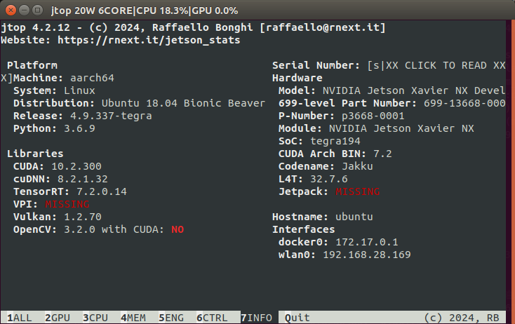
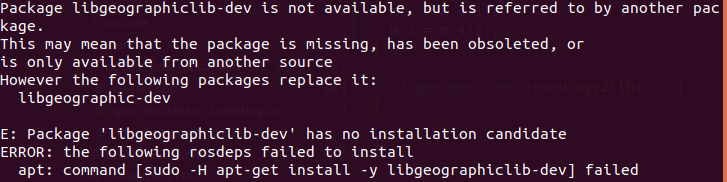
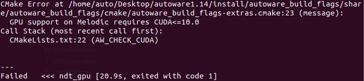

# 路面清扫车项目

## For English Version 
[Click Me!](#road-sweeper-project)  

## 项目简介
- 这是一个大型路面清扫车的项目，基于Ubuntu 18.04，ROS Melodic，Autoware1.14。
- 使用的控制板为NVIDIA Jetson Xavier NX，底盘为线控底盘，使用CAN进行通信。
- 本仓库包含了修改后的Autoware代码、Autoware的底盘控制指令与CAN进行对接的包，激光雷达和IMU/GNSS驱动包，地图文件等。
### 此仓库为本人记录、留存用。不回复issue，不对代码可用性做保证

## 目录
- [项目简介](#项目简介)
- [功能描述](#功能描述)
- [安装指南](#安装指南)
- [使用说明](#使用说明)
- [使用Autoware源代码遇到的问题](#使用autoware源代码遇到的问题)
- [Autoware 源代码修改](#Autoware-源代码修改)


## 功能描述
该项目的主要功能包括：
- 基于Autoware实现路面清扫车的自动驾驶控制
- 通过CAN接口使ROS与线控底盘进行通信
- 在ROS中读取3D激光雷达与IMU/GNSS的数据

## 安装指南
### 使用的Jetson环境：
  
- 注意：opencv一定不能是通过jetpack安装的4.x版本的，必须是安装ros Melodic时自带的opencv3.2，否则编译时会报一堆cv库错误。需要卸载jetpack安装的opencv或者不安装jetpack，手动安装CUDA，cuDnn，TensorRT。    

请按照以下步骤安装和配置项目： 

1.Jetson 刷机安装Ubuntu 18.04  
请参考[CSDN博客](https://blog.csdn.net/weixin_47606814/article/details/127841948?ops_request_misc=%257B%2522request%255Fid%2522%253A%2522568955dfc76993359b335c02fcf6e43f%2522%252C%2522scm%2522%253A%252220140713.130102334..%2522%257D&request_id=568955dfc76993359b335c02fcf6e43f&biz_id=0&utm_medium=distribute.pc_search_result.none-task-blog-2~all~top_positive~default-1-127841948-null-null.142^v100^pc_search_result_base8&utm_term=jetson%20xavier%20nx%E7%83%A7%E5%BD%95%E7%B3%BB%E7%BB%9F&spm=1018.2226.3001.4187)  
注意：选择jetpack版本为4.x.x才是Ubuntu 18.04，同时只安装Jetson OS，并设置安装位置为nvme。

2. 安装相关组件
- 安装jtop，CUDA 10.2，cuDNN  
请参考[CSDN博客](https://blog.csdn.net/a111222zw/article/details/120632906)
- 安装TensorRT  
请参考[CSDN博客](https://blog.csdn.net/weixin_43541510/article/details/130796360)中的单独安装TensorRT部分的内容，注意TensorRT版本必须为7，否则编译Autoware时会报错
- 安装ROS Melodic  
使用鱼香ROS一键安装  
```shell
wget http://fishros.com/install -O fishros && . fishros
```
选择1一键安装ROS，选择更换系统源，选择版本为Melodic(桌面版)
- 安装Autoware编译系统依赖项  
```shell
sudo apt update
sudo apt install python3-pip
sudo apt install -y python-catkin-pkg python-rosdep ros-$ROS_DISTRO-catkin
sudo apt install -y python3-pip python3-colcon-common-extensions python3-setuptools python3-vcstool
pip3 install -U setuptools
```
- 安装Eigen3.3.7  
请参考[CSDN博客](https://blog.csdn.net/reasonyuanrobot/article/details/114372363)

- 创建路面清扫车工作空间
```shell
mkdir -p road-sweeper.ws
```

- 克隆源代码
```shell
git clone -b source https://github.com/wang-ruifan/Road-sweeper.git
```
将克隆得到的文件内的src文件夹下的所有文件复制到road-sweeper.ws文件夹下的src文件夹内
```shell
cp -r Road-sweeper/src/* road-sweeper.ws/src/
```

- 安装rosdepc
使用鱼香ROS一键安装rosdepc  
```shell
wget http://fishros.com/install -O fishros && . fishros
```
选择3一键安装rosdepc，然后
```shell
rosdepc update
cd road-sweeper.ws
rosdepc install -y --from-paths src --ignore-src --rosdistro $ROS_DISTRO
```

- 编译，安装
```shell
AUTOWARE_COMPILE_WITH_CUDA=1 colcon build --cmake-args -DCMAKE_BUILD_TYPE=Release
```
若没有安装CUDA，则为
```shell
colcon build --cmake-args -DCMAKE_BUILD_TYPE=Release
```
选择特定包编译时，为
```shell
colcon build --cmake-args -DCMAKE_BUILD_TYPE=Release --packages-select xxx
```

## 使用说明
### 使用Autoware相关功能
请参考[Autoware使用教程](docs/Autoware自动驾驶使用教程v1.2.pdf)

### 使用Autoware命令转换至CAN  
查看相关[使用说明](https://github.com/wang-ruifan/Road-sweeper/tree/source/src/autowarecmd_to_can/README.md)

## 使用Autoware源代码遇到的问题

1. rosdep时报错：libgeographiclib-dev is not available  
  
同时，安装替换项libgeographic-dev也无法解决。在[Ubuntu Package发行网站上搜索](https://packages.ubuntu.com/search?suite=all&searchon=names&keywords=libgeographiclib-dev)，只在24.04和24.10下提供，可能是由于Autoware.ai版本太老，没有更新，当时所需的package已失效。在源代码的package.xml中搜索，发现只有[lanelet2_extension](https://github.com/wang-ruifan/Road-sweeper/tree/source/src/autoware/common/lanelet2_extension/package.xml)中需求libgeographiclib-dev。而高精地图还有vector map的格式，故通过[修改lanelet2_extension的package.xml](#lanelet2_extension包信息文件-删除对libgeographiclib-dev的依赖)。重新进行rosdep后，所有依赖项均安装完成。  


2. 使用CUDA编译时，ndt_gpu failed  
显示CMake Error  
  
由于jetpack只提供x.2版本的CUDA，而CUDA10.0和CUDA10.2提供的库文件基本没有差别，故[修改cmake文件]，重新编译后问题解决。  
虽然但是，后面在使用ndt_mapping和ndt_matching时，使用pcl_anh_gpu方法会导致GPU占用率直接拉满然后死机；使用pcl_anh方法则正常，同时比pcl_generic方法快很多。欧式聚类时勾选使用GPU也会比不勾选快很多，查看jtop也发现GPU线程中有欧式聚类，所以不确定这种方法是否为正常调用GPU进行加速。

3. 使用op_planner进行导航时，到达第一个nav_goal后，无法继续下发nav_goal  
在op_global_palnner中勾选了replanning，按理来说应该支持到达目标后重规划，但是没有，无论如何发布新的nav_goal都没有反应。  
搜索后根据[CSDN博客](https://blog.csdn.net/m0_65512360/article/details/143436798)及[CSDN博客](https://blog.csdn.net/qq_38861347/article/details/134973913)，了解到当到达nav_goal目标点附近但没有完全到达时，车辆状态切换为END，此时/final_waypoints话题中不发布速度信息。而在正常行驶过程中时，车辆的状态应为FORWARD。  
所以应该修改车辆状态的发布，在当前任务完成并且没有目标时，执行原逻辑；否则，即当前任务完成但是有目标未完成时，将之前状态误切换为END导致没完成的目标prevGoal重新赋值为当前目标，并将车辆状态设为FORWARD。故对[op_global_planner全局路径规划主循环中重规划的条件]和[op_planner的BehaviorStateMachine车辆行为状态发布]进行修改。重新编译op_planner和op_global_planner，解决此问题。

4. 使用fix2pose定位转换为位姿时，发布的gps pose与点云地图不匹配，偏差很大  
因为Autoware是日本开发的，所以在gps/fix转换为pose时的参考经纬度都设在日本。故需要修改为所在地的经纬度。  
搜索后参考[Blog](https://blog.yanjingang.com/?p=10031)及[附赠的Autoware使用手册](docs/Autoware自动驾驶使用教程v1.2.pdf)中的gnss辅助定位，对[经纬度转换为位姿信息的对象，修改了参考点的经纬度和位姿发布的业务逻辑](#gnss信息转换对象修改所在地经纬度增加转换矩阵)，将旋转矩阵和平移向量修改为播放bag并运行定位和[gnss转换矩阵计算节点](https://github.com/wang-ruifan/Road-sweeper/tree/source/src/gnss_matrix/scripts/gnss_matrix.py)得到的值(gnss转换矩阵计算已单独打包为gnss_matrix，[使用方法](https://github.com/wang-ruifan/Road-sweeper/tree/source/src/gnss_matrix/README.md))。  
之后重新编译gnss包，运行后显示gps与实际位置匹配良好。

5. 使用GNSS辅助NDT定位时，频繁重定位  
由于gps信息不一定完全精确，主要是朝向经常出错。当ndt匹配不成功时，调用gnss进行定位，但是又因朝向等原因也无法匹配，导致ndt和gnss来回切换。  
同样参考[Blog](https://blog.yanjingang.com/?p=10031)，[修改使用gnss辅助定位时的业务逻辑](#ndt定位节点修改使用gnss辅助定位时的位姿重置逻辑)  
重新编译lidar_localizer包，解决此问题，ndt定位效果良好，终于不用手动发布大概的初始位姿了。

6. 使用open_planner无法避障，没有跟踪的物体信息  
参考[使用手册](docs/Autoware自动驾驶使用教程v1.2.pdf)的雷达目标识别，启动了欧式聚类节点并将输出参考系设为map，同时启动滤波物体跟踪节点，但是在rviz中没有显示物体，物体序号，物体距离，只有聚类的点云。  
打开rqt_graph，查看节点信息，设置显示为node(all)，查看节点状态。  
发现lidar_euclidean_cluster_detect节点发布了两个topic的信息，其中/detection/lidar_detector/cloud_clusters为聚类后的点云信息，但是没有被订阅。而lidar_kf_contour_track订阅的是/cloud_clusters话题。应该是autoware1.14在对部分功能进行更新时，没有同步更新话题名。故[对跟踪节点的订阅话题进行修改](#点云滤波跟踪节点修改订阅话题)。  
之后发现物体定位好像不是很准，搜索后，参考[CSDN博客](https://blog.csdn.net/qq_38861347/article/details/126136849)，[修改欧式聚类节点的发布信息](#点云欧式聚类节点增加发布信息)。  
重新编译lidar_kf_contour_track和lidar_euclidean_cluster_detect包后解决，可以正常识别物体并执行避障。  


## Autoware 源代码修改
为了解决上述问题，我对Autoware的源代码进行了以下修改：  

### lanelet2_extension包信息文件: 删除对libgeographiclib-dev的依赖
修改了[package.xml](https://github.com/wang-ruifan/Road-sweeper/tree/source/src/autoware/common/lanelet2_extension/package.xml)，删除了其中对libgeographiclib-dev的依赖。  

### autoware_build_flag的cmake文件：将需求CUDA版本从小于等于10.0变为小于等于10.2
修改了[build_flages的cmake文件](https://github.com/wang-ruifan/Road-sweeper/tree/source/src/autoware/common/autoware_build_flags/cmake/autoware_build_flags-extras.cmake)，将需要CUDA版本<=10.0改为<=10.2。  

### op_global_planner节点：修改MainLoop主循环中执行重规划的条件
修改了[op全局规划](https://github.com/wang-ruifan/Road-sweeper/tree/source/src/autoware/core_planning/op_global_planner/nodes/op_global_planner_core.cpp)的主循环MainLoop中，执行Replanning业务逻辑的条件，增加了“m_iCurrentGoalIndex < m_GoalsPos.size()-1”。  

### op_planner的车辆行为状态对象：修改当前路径任务完成时，发布的状态信息
修改了[op_planner的车辆行为状态对象](https://github.com/wang-ruifan/Road-sweeper/tree/source/src/autoware/common/op_planner/src/BehaviorStateMachine.cpp)，修改了其中的当前路径任务完成对象的GetNextState方法的业务逻辑，在当前没有目标时，返回当前的状态; 否则将当前目标设为上一个目标，并发布状态为前进。  

### GNSS信息转换对象：修改所在地经纬度，增加转换矩阵
修改了[GNSS信息转换为pose对象](https://github.com/wang-ruifan/Road-sweeper/tree/source/src/autoware/common/gnss/src/geo_pos_conv.cpp)中的set_plane方法，在当传入的num为7时，设置纬度和经度为建图时录制的bag的/gps/fix话题的第一帧数据转换为度分秒后得到的度和分。同时在conv_llh2xyz经纬度转换为位姿方法的最后添加使用旋转矩阵和平移向量进行计算。  

### NDT定位节点：修改使用GNSS辅助定位时的位姿重置逻辑
修改了[NDT-Matching定位](https://github.com/wang-ruifan/Road-sweeper/tree/source/src/autoware/core_perception/lidar_localizer/nodes/ndt_matching/ndt_matching.cpp)的gnss_callback回调函数的业务逻辑，当启用GNSS进行辅助定位，同时没有发布初始位姿或ndt定位质量差时。直接使用当前的gnss位姿信息，发布初始位姿。同时修改调用gnss重置位姿的阈值为1，并添加一个初始位姿发布者initialpose_pub并设置发布话题名为/initialpose。  

### 点云滤波跟踪节点：修改订阅话题
修改了[点云卡尔曼滤波跟踪](https://github.com/wang-ruifan/Road-sweeper/tree/source/src/autoware/core_perception/lidar_kf_contour_track/nodes/lidar_kf_contour_track/lidar_kf_contour_track_core.cpp)的sub_cloud_clusters订阅者订阅的话题名，从/cloud_clusters修改为/detection/lidar_detector/cloud_clusters。  

### 点云欧式聚类节点：增加发布信息
修改了[雷达点云欧式聚类](https://github.com/wang-ruifan/Road-sweeper/tree/source/src/autoware/core_perception/lidar_euclidean_cluster_detect/nodes/lidar_euclidean_cluster_detect/lidar_euclidean_cluster_detect.cpp)的publishCloudClusters方法内的点云聚类发布消息的内容，增加了对聚类转换的平均点、状态和id的赋值。  


# Road Sweeper Project

## Project Introduction
- This is a large-scale road sweeper project based on Ubuntu 18.04, ROS Melodic, and Autoware 1.14.
- The control board used is NVIDIA Jetson Xavier NX, the chassis is a wire-controlled chassis, and CAN is used for communication.
- This repository contains modified Autoware code, packages for interfacing Autoware's chassis control commands with CAN, LiDAR and IMU/GNSS driver packages, map files, etc.
### This repository is for personal record and retention. Issues will not be responded to, and the usability of the code is not guaranteed.

## Table of Contents
- [Project Introduction](#project-introduction)
- [Function Description](#function-description)
- [Installation Guide](#installation-guide)
- [Usage Instructions](#usage-instructions)
- [Issues Encountered with Autoware Source Code](#issues-encountered-with-autoware-source-code)
- [Modifications to Autoware Source Code](#modifications-to-autoware-source-code)

## Function Description
The main functions of this project include:
- Implementing autonomous driving control of the road sweeper based on Autoware
- Communicating between ROS and the wire-controlled chassis via the CAN interface
- Reading 3D LiDAR and IMU/GNSS data in ROS

## Installation Guide
### Jetson Environment Used:
  
- Note: OpenCV must not be the 4.x version installed through Jetpack; it must be the OpenCV 3.2 that comes with ROS Melodic, otherwise, a bunch of cv library errors will occur during compilation. You need to uninstall the OpenCV installed by Jetpack or not install Jetpack, and manually install CUDA, cuDNN, and TensorRT.

Please follow the steps below to install and configure the project:

1. Flash Jetson with Ubuntu 18.04  
Refer to [CSDN Blog](https://blog.csdn.net/weixin_47606814/article/details/127841948?ops_request_misc=%257B%2522request%255Fid%2522%253A%2522568955dfc76993359b335c02fcf6e43f%2522%252C%2522scm%2522%253A%252220140713.130102334..%2522%257D&request_id=568955dfc76993359b335c02fcf6e43f&biz_id=0&utm_medium=distribute.pc_search_result.none-task-blog-2~all~top_positive~default-1-127841948-null-null.142^v100^pc_search_result_base8&utm_term=jetson%20xavier%20nx%E7%83%A7%E5%BD%95%E7%B3%BB%E7%BB%9F&spm=1018.2226.3001.4187)  
Note: Choose Jetpack version 4.x.x for Ubuntu 18.04, install only Jetson OS, and set the installation location to NVMe.

2. Install related components
- Install jtop, CUDA 10.2, cuDNN  
Refer to [CSDN Blog](https://blog.csdn.net/a111222zw/article/details/120632906)
- Install TensorRT  
Refer to the section on installing TensorRT separately in [CSDN Blog](https://blog.csdn.net/weixin_43541510/article/details/130796360), note that the TensorRT version must be 7, otherwise there will be errors when compiling Autoware.
- Install ROS Melodic  
Use FishROS one-click installation  
```shell
wget http://fishros.com/install -O fishros && . fishros
```
Select 1 for one-click ROS installation, choose to change the system source, and select the Melodic (desktop) version.
- Install Autoware compilation system dependencies  
```shell
sudo apt update
sudo apt install python3-pip
sudo apt install -y python-catkin-pkg python-rosdep ros-$ROS_DISTRO-catkin
sudo apt install -y python3-pip python3-colcon-common-extensions python3-setuptools python3-vcstool
pip3 install -U setuptools
```
- Install Eigen 3.3.7  
Refer to [CSDN Blog](https://blog.csdn.net/reasonyuanrobot/article/details/114372363)

- Create road sweeper workspace
```shell
mkdir -p road-sweeper.ws
```

- Clone the source code
```shell
git clone -b main https://github.com/wang-ruifan/Road-sweeper.git
```

- Install rosdepc
Use FishROS one-click installation of rosdepc  
```shell
wget http://fishros.com/install -O fishros && . fishros
```
Select 3 for one-click rosdepc installation, then
```shell
rosdepc update
cd road-sweeper.ws
rosdepc install -y --from-paths src --ignore-src --rosdistro $ROS_DISTRO
```

- Compile and install
```shell
AUTOWARE_COMPILE_WITH_CUDA=1 colcon build --cmake-args -DCMAKE_BUILD_TYPE=Release
```
If CUDA is not installed, use
```shell
colcon build --cmake-args -DCMAKE_BUILD_TYPE=Release
```
To compile specific packages, use
```shell
colcon build --cmake-args -DCMAKE_BUILD_TYPE=Release --packages-select xxx
```

## Usage Instructions
### Using Autoware-related functions
Refer to [Autoware Usage Tutorial](docs/Autoware自动驾驶使用教程v1.2.pdf)

### Converting Autoware commands to CAN  
Refer to the [Usage Instructions](https://github.com/wang-ruifan/Road-sweeper/tree/source/src/autowarecmd_to_can/README.md)

## Issues Encountered with Autoware Source Code

1. rosdep error: libgeographiclib-dev is not available  
  
Installing the alternative libgeographic-dev did not solve the issue. Searching on the [Ubuntu Package website](https://packages.ubuntu.com/search?suite=all&searchon=names&keywords=libgeographiclib-dev), it is only available for 24.04 and 24.10, possibly because the Autoware.ai version is too old and the required package is no longer available. Searching the package.xml in the source code, only [lanelet2_extension](https://github.com/wang-ruifan/Road-sweeper/tree/source/src/autoware/common/lanelet2_extension/package.xml) requires libgeographiclib-dev. Since high-precision maps also have vector map formats, the dependency on libgeographiclib-dev was removed from the package.xml of lanelet2_extension. After re-running rosdep, all dependencies were installed successfully.  


2. ndt_gpu failed during CUDA compilation  
Shows CMake Error  
  
Since Jetpack only provides x.2 versions of CUDA, and CUDA 10.0 and CUDA 10.2 libraries are almost identical, the cmake file was modified to resolve the issue.  
However, using pcl_anh_gpu for ndt_mapping and ndt_matching caused the GPU to max out and crash; using pcl_anh worked normally and was much faster than pcl_generic. Enabling GPU for Euclidean clustering also sped up the process significantly, indicating that the GPU was being used for acceleration.

3. op_planner does not continue to issue nav_goal after reaching the first nav_goal  
Replanning was enabled in op_global_planner, but it did not replan after reaching the goal. No response to new nav_goal.  
Based on [CSDN Blog](https://blog.csdn.net/m0_65512360/article/details/143436798) and [CSDN Blog](https://blog.csdn.net/qq_38861347/article/details/134973913), the vehicle state switches to END when near the nav_goal but not fully reached, causing /final_waypoints to not publish speed information. Normally, the vehicle state should be FORWARD.  
The vehicle state publishing logic was modified to set the previous goal as the current goal and the vehicle state to FORWARD when a goal is incomplete. The main loop in op_global_planner and the BehaviorStateMachine in op_planner were modified. Recompiled op_planner and op_global_planner to resolve the issue.

4. Large deviation in gps pose when converting fix2pose  
Autoware's reference latitude and longitude are set in Japan. Modified to local latitude and longitude.  
Based on [Blog](https://blog.yanjingang.com/?p=10031) and the [Autoware Usage Manual](docs/Autoware自动驾驶使用教程v1.2.pdf), the reference point latitude and longitude and pose publishing logic were modified. Recompiled the gnss package, and the gps matched the actual position well.

5. Frequent relocation when using GNSS-assisted NDT localization  
GPS information is not always accurate, especially orientation. When ndt matching fails, it switches to gnss, causing frequent switching.  
Based on [Blog](https://blog.yanjingang.com/?p=10031), the logic for resetting the pose using gnss was modified. Recompiled the lidar_localizer package to resolve the issue, improving ndt localization.

6. No object tracking information when using open_planner  
Started Euclidean clustering and filtering nodes, but no object information in rviz.  
Checked rqt_graph, found that lidar_euclidean_cluster_detect published two topics, but /cloud_clusters was not subscribed. Modified the subscription topic in lidar_kf_contour_track.  
Improved object localization based on [CSDN Blog](https://blog.csdn.net/qq_38861347/article/details/126136849). Recompiled lidar_kf_contour_track and lidar_euclidean_cluster_detect to resolve the issue.

## Modifications to Autoware Source Code
To solve the above issues, the following modifications were made to the Autoware source code:

### lanelet2_extension package.xml: Removed dependency on libgeographiclib-dev
Modified [package.xml](https://github.com/wang-ruifan/Road-sweeper/tree/source/src/autoware/common/lanelet2_extension/package.xml) to remove the dependency on libgeographiclib-dev.

### autoware_build_flag cmake file: Changed required CUDA version to <=10.2
Modified [autoware_build_flags-extras.cmake](https://github.com/wang-ruifan/Road-sweeper/tree/source/src/autoware/common/autoware_build_flags/cmake/autoware_build_flags-extras.cmake) to change the required CUDA version to <=10.2.

### op_global_planner node: Modified MainLoop replanning conditions
Modified the [op_global_planner_core.cpp](https://github.com/wang-ruifan/Road-sweeper/tree/source/src/autoware/core_planning/op_global_planner/nodes/op_global_planner_core.cpp) MainLoop to add the condition "m_iCurrentGoalIndex < m_GoalsPos.size()-1" for replanning.

### op_planner BehaviorStateMachine: Modified state publishing logic when current task is completed
Modified the [BehaviorStateMachine.cpp](https://github.com/wang-ruifan/Road-sweeper/tree/source/src/autoware/common/op_planner/src/BehaviorStateMachine.cpp) to return the current state when there is no goal, otherwise set the previous goal as the current goal and publish the state as FORWARD.

### GNSS conversion: Modified local latitude and longitude, added transformation matrix
Modified the [geo_pos_conv.cpp](https://github.com/wang-ruifan/Road-sweeper/tree/source/src/autoware/common/gnss/src/geo_pos_conv.cpp) set_plane method to set latitude and longitude to the first frame of /gps/fix from the recorded bag. Added rotation matrix and translation vector to conv_llh2xyz.

### NDT localization: Modified pose reset logic using GNSS
Modified the [ndt_matching.cpp](https://github.com/wang-ruifan/Road-sweeper/tree/source/src/autoware/core_perception/lidar_localizer/nodes/ndt_matching/ndt_matching.cpp) gnss_callback to use current gnss pose when GNSS is enabled and no initial pose is published or ndt quality is poor. Changed the threshold to 1 and added an initialpose_pub.

### Point cloud tracking: Modified subscription topic
Modified the [lidar_kf_contour_track_core.cpp](https://github.com/wang-ruifan/Road-sweeper/tree/source/src/autoware/core_perception/lidar_kf_contour_track/nodes/lidar_kf_contour_track/lidar_kf_contour_track_core.cpp) to change the subscription topic from /cloud_clusters to /detection/lidar_detector/cloud_clusters.

### Euclidean clustering: Added publishing information
Modified the [lidar_euclidean_cluster_detect.cpp](https://github.com/wang-ruifan/Road-sweeper/tree/source/src/autoware/core_perception/lidar_euclidean_cluster_detect/nodes/lidar_euclidean_cluster_detect/lidar_euclidean_cluster_detect.cpp) publishCloudClusters method to add average point, state, and id to the published message.
